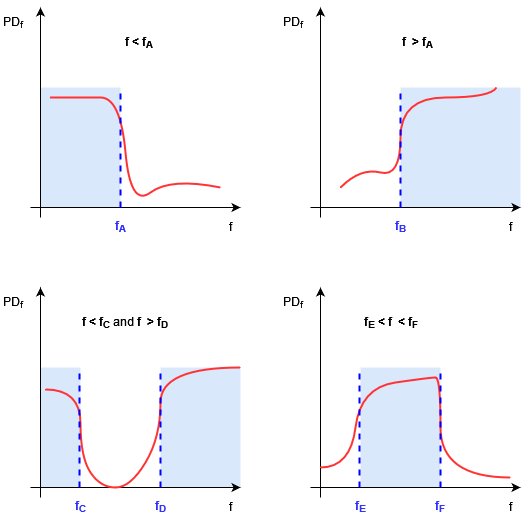
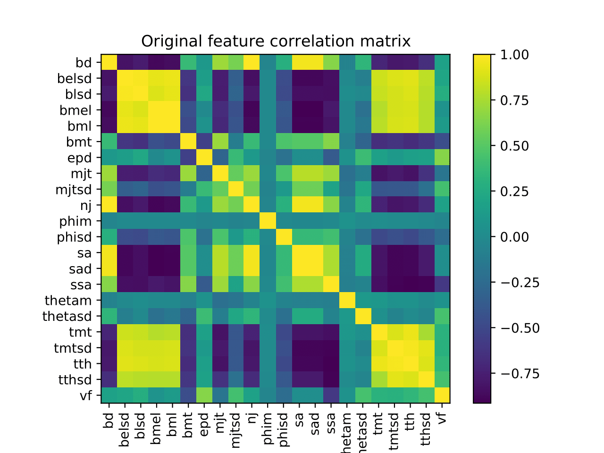
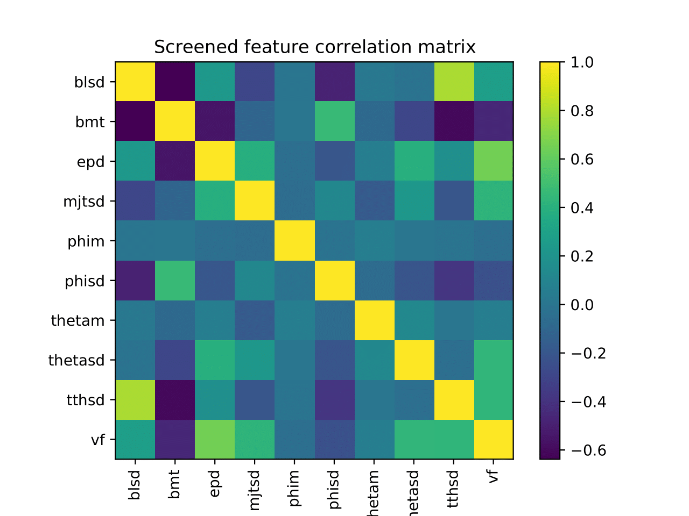
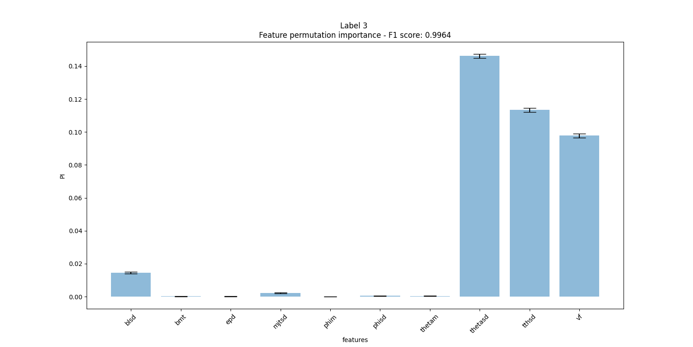
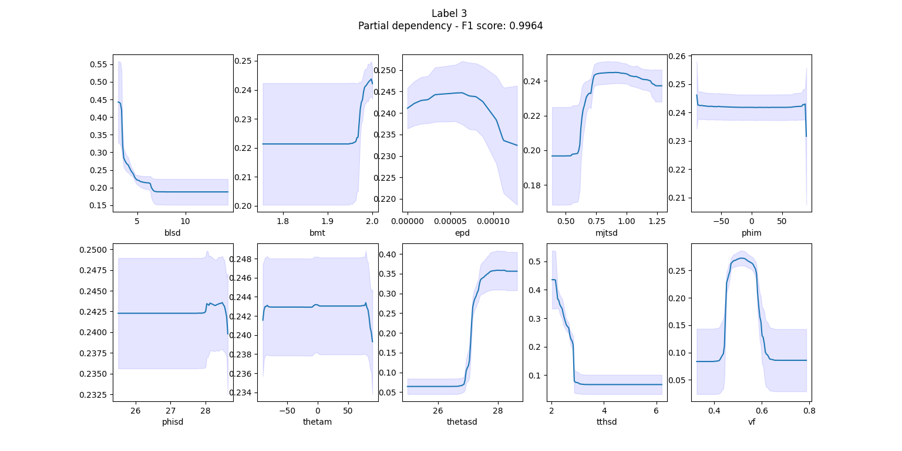

===================================
Case of study: explanation pipeline
===================================

By using the segmentation pipeline clusters are obtained, however it is not at all clear according to which
criteria are they defined. This is typical of machine learning models, which are often regarded as black-boxes
taking something as input and outputting the desired result (if the model is good enough). The situation is even
worst in case of unsupervised machine learning models, as the one used in the segmentation pipeline due to the
requirements under which the segmentation problem was solved. In this tutorial, a methodology to try to understand
how the clusters found can be defined is discussed, so that the user can use this knowledge in order to judge
if a certain cluster is reasonable or not. In this sense, the validation of the segmentation model can be done
through explanation.

.. note::

   Recently it has been observed the `lack of reproducibility <https://reproducible.cs.princeton.edu/#>`_ of many
   works applying machine learning results to different fields, like medicine, bioinformatics, neuroimaging,
   etc... . The :ref:`segmentation pipeline proposed in another tutorial <segmentation_pipeline_rst>` of this
   documentation would trivially fall in one of the data leakage case analysed there, since no test set is available.
   However the lack of a test set to evaluate the pipeline performance is a common situation for the kind of data
   which are typically used in 3d segmentation problems of large biological samples. Indeed the goal of a segmentation
   pipeline is used exactly to avoid to label the image by hand, since it is a time consuming and non-trivial operation
   due to the 3d nature of the problem. In this sense the "validation through explanation" approach of the segmentation
   result, can be seen as a way to evade the lack of test set problem, since the user can decide if the various
   components found by the segmentation pipeline are reasonable or not based on its knowledge in the field.

General strategy
================

The general strategy used to obtain an explanation is the one to train in a supervised manner a classifier to identify
the various cluster found in the segmentation pipeline from a dataset of features, whose meaning is known and clear
to the user. At this point explainable AI techniques are used in order to understand the relation existing between the
model output and the input features, so that the identification of a given cluster is explained in therm of (a subset
of) input features. These explainable AI techniques are often based on the assignment of a score to the model inputs,
so that when the value of this score is close to zero, this feature does not contribute in significant manner to the
model output. From scores of this kind it is possible to obtain a definition of the clusters found by the segmentation
pipeline in terms of the input features used.

To reduce the model dependency of the explanation, the explanation results are not obtained from a single model, but
considering an ensemble of different models (more precisely by averaging the scores assigned to a feature coming from
different models).

Dataset and its preparation
===========================

The input dataset for the explanation pipeline is constructed by computing a series of features having a clear meaning
for the user for a sequence of points/patches of the dataset used as input in the segmentation step. For example one
can divide the 3d binary image to segment according to a regular grid whose unit element is a chosen patch (it can be
a good idea to use the same kind of patch used in the segmentation pipeline). Then compute all the features for each
patch: the results organized in table where the coordinates of the patch, the value of all the features, and the
corresponding label are present. This table can be considered as an example of input dataset for the explanation
pipeline

Which kind of feature should one compute? The answer to this question is problem dependent, and it is something that
the user need to specify according to its knowledge on the sample under study or similar problems. By the way, these
features need to fulfill certain requirements in order to be useful:

* they need to have a *clear meaning for the user*: the final explanation of the clusters identified will be in terms
  of these features and if the meaning is not clear to the user within the context of the problem under study, they are
  useless.

* they need to be *numerical*: this means that they are number the user know how to compute. For categorical variables,
  some form of encoding need to be used, like for example by using dummy variables.

Note that it is not necessary that all the features listed are useful for the description of a certain cluster. In this
sense the user *does not have to decide* which are the most relevant features among the one used to typically describe a
certain sample: this is a result of the procedure explained in this tutorial. In this sense, this "feature specification
step" should be rather simple and not particularly demanding for the user: it should be enough to specify and compute
the set of quantities typically used in problems similar to the one for which the sample is analysed.

The first thing to check is if the features selected are too much linearly correlated. Linear correlation among the
input features of a model may helps during the training but it can be misleading when one tries to find a relation
between the same input feature and the model output. If one tries to assign to some input feature :math:`x` some score
to deduce the input feature-output relation, the score can be arbitrarily distributed among scores of all the other
feature which are linearly correlated with :math:`x`, making the score and any interpretation based on that ambiguous.
To avoid this problem, the amount of linear correlation (also called *multicollinearity*) need to be reduced.

To detect the presence of multicollinearity an effective method is the one of computing the `*variance inflation factor*
<https://en.wikipedia.org/wiki/Variance_inflation_factor>`_ (VIF) of each feature [Snee1981]_ [Obrien2007]_. Given the
:math:`i`-th feature, this quantity is defined as

.. math::

   VIF_i = \frac{1}{1-R^2_i}

where :math:`R^2_i` is the :math:`R^2` coefficient of a linear regression which use all the feature in the dataset
except the :math:`i`-th one, which is used as target of the regression. The VIF is a number between 1 and
:math:`+\infty`: it is equal to 1 when the considered feature is not linearly correlated to any other feature
present in the dataset, while it goes towards infinity as the linear correlation increase.

Therefore putting a threshold on the maximal allowed VIF for a given dataset can be a way to quantify the maximal
amount of liner correlation among the features in the dataset. Note that the VIF of one feature depends on all the
feature present in the dataset when is computed. Keeping this in mind, the multicollinearity in the dataset can be
reduced with the simple procedure below:

    1. Chose a threshold :math:`VIF_{TH}` value for the VIF;

    2. Compute the VIF for arr the features;

    3. If the VIF of some feature is above :math:`VIF_{TH}`, remove the feature with the biggest VIF.

    4. If a feature was eliminated in the previous step, repeat the step 2 and 3.

The set of feature surviving to this procedure generate a dataset having a lower amount linear correlation. One
can say that the various feature are almost linear independent among each other, in the sense of linear algebra, which
means that the information contained in the dataset can be approximately well represented in a vector space having
dimension equal to the number of surviving features.

The simple procedure described till now is implemented in the :ref:`MultiCollinearityReducer
<multicollinearity_reducer_section>` operation. The most important parameters of this operation are.

- ``data_columns``, where one specify which columns of the input dataset need to be considered as input features (note
  that in this operation one need to specify also the column of the target in ``target_columns``).

- ``VIF_th`` which is the VIF threshold (typical values are 5 or 10).

.. note::

   Other output of this operation can be quite interesting: the so called linear association. It can be obtained
   by setting ``return_linear_association = 'full'`` or ``return_linear_association = 'pairwise'``, depending if the
   *full linear association* or the *pairwise linear association* is required. With these two setting, in the reading
   folder of the trace a dictionary is saved in json format.

   In the full linear association for each eliminated feature, the coefficients of the linear model describing the
   eliminated feature are stored in the dictionary saved. More precisely, if :math:`Y_k` is the eliminated feature
   and :math:`X_0,\cdots,X_n` are the n surviving features, then in the full linear association dictionary for
   :math:`Y_k` the coefficients :math:`w_{k,0},\cdots,w_{k,n},q_k` of the linear model

   .. math::

      Y_k = w_{k,0} X_0 + \cdots + w_{k,n} X_n +q_k,

   are saved.

   On the other hand, in the pairwise linear association for each eliminated feature, the coefficients of the
   linear models describing the eliminated feature one of the surviving features are saved. This means that pairwise
   linear association dictionary for each eliminated feature :math:`Y_k` the coefficients :math:`w_{k,i},q_{k,i}` of
   the linear models

   .. math::

      Y_k = w_{k,i}X_i +q_{k,i},

   for any surviving feature :math:`X_i`, are saved.

   Note that, since these linear models are produced using as inputs features with a low level of multicollinearity, the
   coefficients of the linear models can be used to rank which of the surviving feature can be the most suitable
   *substituted* with one of the features eliminated, without altering too much the maximal VIF of the dataset.

Tools for the explanation
=========================

The basic idea behind this explanation pipeline is to train in a supervised setting a classifiers, from a set of
meaningful features to predict the clusters found by the segmentation pipeline, and get the explanation of the clusters
by explaining the classifiers decision in terms of the input feature. The model used as classifier

- for each cluster one should train a different ensemble of classifiers: the kind of classifier, hyperparameters,
  etc... should be all the same for all the cluster but vary within the ensemble associate to it.

- classification problem should be binary, i.e. the classifiers for a given label should be trained to predict 1 when
  the classifier input features corresponds to label and 0 otherwise.

The first requirement is needed in order to have an explanation that is tailored for each label, and the use of an
ensemble rather than a single model is done in order to reduce a possible model dependency in the explanation obtained,
as mentioned above. The second requirement is needed for the interpretation of the scores, as will be clear in the next
section.

From a practical point of view, the model selected should have enough "power" to work well for generic classification
problem: neural networks or random forests seem to be good choice (despite simple system can be used). Another practical
requirement is that the amount of computational resources needed for the training il modest, since training happens
for each label and for each model of the ensemble. This last requirement favor random forest over neural networks.

In bmmltools random forest are used, and ensembles are created by training random forests with different hyperparameters
combinations.

.. note::

   As will be clear from the next section, it is fundamental to check if the model generalize correctly or simply
   overfit over the training dataset. To check that first the full dataset of input feature need to be split into
   a training and validation dataset. The classifier is then trained with a `shuffled stratified K-fold
   cross-validation <https://scikit-learn.org/stable/modules/cross_validation.html#stratified-shuffle-split>`_ in
   order to select the best model, whose performance can be than evaluated with the validation dataset.

The explanation is derived by computing certain scores from the trained ensemble of classifiers. In the explanation
pipeline presented in this tutorial, various tools turns out to be particularly useful: the classifier *accuracy* and
*F1-score*, the *permutation importance*, and the  *partial dependency* for each features. How they are defined is
briefly reported below, while how to use them to get an explanation will be discussed in the next section.

**Accuracy**

The Accuracy is a simple and popular metric to evaluate binary classifier. In the case considered here, it is used to
evaluate the performance of the trained models. In a binary
classification problem, the following considered:

* *true positive*, :math:`TP`, i.e. the number of all the examples in the test dataset which are labeled by 1 and
  the classifier correctly predict as 1;

* *true negative*, :math:`TN`, i.e. the number of all the examples in the test dataset which are labeled by 0 and the
  classifier correctly predict as 0;

* *false positive*, :math:`FP`, i.e. the number of all the examples in the test dataset which are labeled by 1 but the
  classifier predict them as 0;

* *false negative*, :math:`FN`, i.e. the number of all the examples in the test dataset which are labeled by 0 but the
  classifier predict them as 1;

The accuracy is defined as

.. math::

   \mbox{Acc} = \frac{TP+TN}{TP+TN+FP+FN}

which is the ratio between number of correctly classified examples and the total number of examples in the dataset.
It can take values between 0 and 1, reaching 1 in case all the examples are correctly classified.

Suppose to have a dataset having an equal number of example corresponding to the label 0 and the label 1, then a
classifier which output at random 0 or 1 whatever is the input (therefore a very bad classifier), would have an
accuracy of 0.5, since on average half of the time will predict the correct result. This would not be so, if the
dataset is not balanced, which makes the interpretation more tricky (the very bed classifier would have an accuracy
equal to the fraction of label 1 present in the dataset, inflating or contracting the accuracy). Therefore, in this
case it is better to use the *balanced accuracy*, which is defined below

.. math::

   \mbox{bal-Acc} = \frac{1}{2}\left( \frac{TP}{TP+FN} + \frac{TN}{TN+FP} \right)

which would return 0.5 for the random classifier even for unbalanced dataset. Since the random classifier is a very bad
case, one may want that the "adjust" the balanced accuracy values, so that the random classifier case takes value 0.
This is the so called *adjusted accuracy*, which is simply

.. math::

   \mbox{adj-Acc} = 2\mbox{bal-Acc} -1

The adjusted accuracy is also called *informedness* or *Youden's J statistic*.

**F1-score**

Recalling the previous classification of the prediction of the classifier, the F1-score is defined as the ratio below,

.. math::

   F_1 = \frac{2TP}{2TP+FP+FN},

and can be seen as the harmonic mean between the classifier precision and recall. Typically is more robust than the
accuracy in quantifying the model prediction but is less transparent ot a direct interpretation.

**Permutation importance**

The permutation importance, PI, measure how the model performance changes when the value of a given feature is
replaced with a random value *sampled* from the same distribution [Breiman2001]_. The model performance are measured by
means of a given metrics.

Let :math:`X = \{X_n\}_{n=0}^{N-1}` be the input dataset used to train a model :math:`f`, and let
:math:`X_n = (x_{n,0},\cdots,x_{n,m-1})` be the :math:`n`-th example composed by :math:`m` features. Each example
:math:`X_n` can be seen as the result of the sampling of an :math:`m`-dimensional probability distribution
:math:`p(x) = p(x_0,\cdots,x_{m-1})` characterizing the dataset. *Assuming (statistical) independence among the
input features* one can write

.. math::

   p(x_0,\cdots,x_{m-1}) = p_0(x_0)\cdot p_1(x_1) \cdot \ldots \cdot p_{m-1}(x_{m-1}).

To compute the PI of the :math:`k`-th feature one as to evaluate the model using a series of examples
:math:`\tilde{X}_n = (x_{n,0},\cdots,x_{n,k-1},\tilde{x}_{n,k},x_{n,k+1},\cdots,x_{n,m-1})`, where
:math:`\tilde{x}_{n,k} \sim p_k(x_k)`, i.e. :math:`\tilde{x}_{n,k}` is sampled from the distribution of
the :math:`k`-th feature :math:`p_k(x_k)`. The probability distribution :math:`p(x)` is not known, therefore to
generate new samples for :math:`x_k` one is forced to use the permutation trick. More precisely, given a permutation of
the numbers :math:`\{0,1,\cdots,N-1\}`, :math:`\sigma`, one can define
:math:`X^{(k-perm)} = \{X^{(k-perm)}_n\}_{n=0}^{N-1}` as the dataset with examples
:math:`X^{(k-perm)}_n = (x_{n,0},\cdots,x_{n,k-1},x_{\sigma(n),k},x_{n,k+1},\cdots,x_{n,m-1})`. Note that by permuting
the :math:`k`-th feature one is effectively sampling :math:`p_k(x_k)`. At this point, the PI of the :math:`k`-th
feature is defined as

.. math::

   PI_k = L(y,f(X^{(k-perm)})) - L(y,f(X))

where :math:`L` is the selected metric, and :math:`y = {y_n}_{n=0}^{N-1}` are the targets corresponding to each example
of the dataset. In bmmltools the permutation importance is computed according to the `sklearn implementation
<https://scikit-learn.org/stable/modules/generated/sklearn.inspection.permutation_importance.html#sklearn.inspection.permutation_importance>`_
uses the mean accuracy as metric for the model used as classifier (which is a Random Forest).

.. note::

   Sometimes the PI can assumes negative values for certain feature. This means that the performance of the model
   increase if the noise is given as input rather than the actual value of the feature (clearly, the values of all the
   other features are given as input as well). This means that the feature considered actually confuse the model
   rather than help: the model would probably perform better, if this feature is removed from the inputs. When the
   dataset has a low level of multicollinearity, this problem should be minimal or nor happen at all.

.. note::

   The assumption of independence of the feature, is not easy to ensure in general. This is why the permutation
   importance should be computed for model trained on dataset with no or low amount of multicollinearity: so that
   the correlation is reduced. Keep in mind that lack of correlation is a necessary but not sufficient condition
   for independence among features.

**Partial dependency**

To gain insight on the relation between the classifier prediction and the input features the partial dependencies
(also called partial dependency plots [Friedman2001]_ [Molnar2022]_) turns out to be very useful.

Given the input dataset :math:`X = \{X_n\}_{n=0}^{N-1}` composed by examples :math:`X_n = (x_{n,0},\cdots,x_{n,m-1})`
having :math:`m` features, consider a subset of indices :math:`S = \{a_1,\cdots,a_p\}`, where
:math:`a_i \ in I =\{0,1,\cdots,m-1\}` and its complement with respect to the set of all indices :math:'S^c = I/S'.
Since to each index :math:`k` corresponds to a feature, one can split each example :math:`X_n` as

.. math::

   \begin{align}
   X_n &= (x^S_n,x^{I/S}_n) \\
   x^S_n &= (x_{n,\alpha_1},\cdots,x_{n,\alpha_p} ) \mbox{ with } \alpha_i \in S \\
   x^{I/S}_n &= (x_{n,\beta_1},\cdots,x_{n,\beta_{m-p}} ) \mbox{ with } \beta_i \in I/S
   \end{align}

which effectively split the input feature on which the model is trained in two group. The partial dependency of a model
:math:`f` for the features corresponding to :math:`S`, is defined as the expectation value of the marginal
probabiltiy distribution of the :math:`I/S` features, namely

.. math::

   \begin{align}
   PD_S(z_1,\cdots,z_p) &= E_{x^{I/S}}[ f(z_1,\cdots,z_p,x^{I/S}) ] \\
   &= \int f(z_1,\cdots,z_p,x^{I/S}) p(x_{\beta_1},\cdots,x_{\beta_{m-p}}) dx_{\beta_1},\cdots,dx_{\beta_{m-p}}
   \end{align}

where :math:`(z_1,\cdots,z_p)` is possible value of the features in :math:`S`.
The probability distribution association to the dataset is typically unknown, and so is its marginal, therefore further
assumptions need to be done. *Assuming again (statistical) independence among the input feature* one can write that

.. math::

   p(x_{\beta_1},\cdots,x_{\beta_{m-p}} = p_{\beta_1}(x_{\beta_1})\cdot \ldots \cdot p_{\beta_{m-p}}(x_{\beta_{m-p}})

which allow to estimate the partial dependency from the dataset directly, since the integral in this case can be
approximated with the empirical average over the :math:`I/S` features, namely

.. math::

   PD_S(z_1,\cdots,z_p) \approx \frac{1}{N}\sum_{n=0}^{N-1} f(z_1,\cdots,z_p,x_{n,\beta_1},\cdots,x_{n,\beta_{m-p}})

where :math:`x_{n,\beta_1},\cdots,x_{n,\beta_{m-p}}` are the values assumed by the :math:`I/S` features in the example
:math:`n`, while :math:`z_1,\cdots,z_p` is the point in which the partial dependency is computed.

Particularly interesting for this tutorial is the case where :math:`S` contains a single feature, which is here called
*partial dependency of the feature* :math:`k`, which is simply computed as

.. math::

   PD_k(z) \approx \frac{1}{N}\sum_{n=0}^{N-1} f(x_{n,0},\cdots,x_{n,k-1},z,x_{n,k+1},\cdots,x_{n,m})

where :math:`z` varies over the range of the feature in the dataset, i.e. :math:`z \in [\min_n x_{n,k},\max_n x_{n,k}]`.
It is interesting to observe that the relation detected from the partial dependency admit a causal interpretation
provided that certain additional requirements are satisfied by the features [Qingyuan2021]_.

.. note::

   The assumption of independence among features is the one allowing to compute the PD of a given
   feature as an empirical average. That is why one should be computed it for model trained on dataset with no or
   low amount of multicollinearity: so that the correlation is reduced, which is a necessary (but not sufficient)
   condition for statistical independence. It is known that the PD works well when the features are not correlated
   among each other [Molnar2022]_.

Interpreting F1 scores, PI and PD
=================================

The first to do once that a classifier of the ensemble associated to a given label is trained is to check if the model
are able to generalize on the validation set or not. This is measured by the F1 score, which should be close to 1 in
order to be sure that the model correctly generalize. In bmmltools, for an ensemble of classifier the average F1 score
is be used rather than the individual F1 scores.

This is very important since if the model overfit on the training, the explanation obtained does not make sense. The
lack of generalization or more generally a small value of the F1 score can happen essentially for two reasons
(assuming the model used is powerful enough):

1. The cluster does not make sense, therefore the model is not able to find any relation between the input feature and
   the given label;

2. The cluster make sense but the input feature are not able to describe it.

Clearly a low F1 score alone is not enough to conclude that a clustering does not make sens, by the way if the user
is for various reason certain about the "goodness" of the features used, this can be a strong indication that the
clusters whose F1 score is low, are probably not real clusters.

.. attention::

   Before to completely rule out a cluster, it can be a good idea to enlarge/change the set of features used as
   input features for the explanation pipeline and check if the F1 score still remain low.

If there are no reason to invalidate the models ensemble associated to a cluster, the next step to get an explanation
is to look at the PI of the features. Feature with an high permutation importance are likely to be the most influential
features of the model, i.e. change their value would likely to change in a significant manner the model output (measured
via a suitable metric). Naively, one can say that, highest is the PI of a feature and more this feature is relevant
for the model in order to recognize the corresponding cluster.

A simple criteria to select the most relevant feature is to sort the feature according to its permutation importance
in decreasing order. By selecting a given threshold :math:`TH`, one can keep the first :math:`M < p` sorted features
such that

.. math::

   \begin{align}
   \frac{1}{N}\sum_{k=0}^{M-2} PI_{\mbox{sorted }k} &\leq TH \\
   \frac{1}{N}\sum_{k=0}^{M-1} PI_{\mbox{sorted }k} &> TH
   \end{align}

where :math:`N = \sum_{k=0}^p \max(0,PI_{\mbox{sorted }k})` is a normalization constant such that the sum of the positive
permutation importance is equal to 1. In this way one can interpret :math:`100 \cdot TH` as the percentage of positive
permutation importance explained by the :math:`M` selected features. The features selected in this way are the one
that will be used to explain the cluster.

Once that the most relevant features has been identified, the next step is to find the interval of values which can
be used to define the cluster. This can be done by looking at the partial dependency of the feature. Recalling that the
model outputs 1 when the cluster is detected, and that the partial dependency capture how the model output changes on
(partial) average as the feature value change within its range, one can easily define the characteristic interval for
the feature value as the region of the feature range where the partial dependency is high with respect to the
surrounding values. Consider the examples in the picture below

|

In the example some common behaviors of the partial dependency for some feature is showed. According to the principle
explained above, the regions where the partial dependency is sufficiently high with respect of its surrounding, is
the region one is looking for to explain the cluster.

In the first two graph above, describe the situation where a single threshold is needed to describe the interval,
namely situation like :math:`[\min_n f_{n,k}, f_{th}]` or :math:`[f_{th},\max_n f_{n,k}]`. In the second line, two
threshold are needed, i.e. for intervals like :math:`[f_{th_1},f_{th_2}]` or
:math:`[\min_n f_{n,k}, f_{th_1}] \cap [f_{th_2},\max_n f_{n,k}]`. Clearly this discussion can be generalized easily
to more complex intervals. Note that all the intervals are always limited to the feature range, i.e.
:math:`[\min_n f_{n,k},\max_n f_{n,k}]`, since nothing can be said outside this range.

At this point the proper explanation of the cluster can be obtained. Let :math:`L` be the cluster label and assume
that :math:`f_1,\cdots,f_M` are the most relevant feature found using the PI. Let :math:`\Delta_1,\cdots,\Delta_M`
be the intervals found using the PDs of each relevant feature. Then the explanation of the considered cluster is:

.. math::

   \mbox{cluster L } \Longleftrightarrow f_1 \in \Delta_1, \cdots, f_M \in \Delta_M.

Defining a cluster in this way allow the user to judge if the cluster make sense or not for its specific problem
by using its specific knowledge of the problem.

It is also possible to assign a score to the explanation obtained. This can be trivially done constructing an
*if-else classifier* for each cluster, which simply classify a given input as belonging to a given cluster if and only
if the most relevant features fall in the intervals corresponding to the considered cluster, and evaluate the
performance of the classifier using some metric, since the ground true result are known. In bmmltools, the balanced
accuracy (or the adjusted one) is used to evaluate the "goodness" of the explanation obtained, since it is easier to
interpret (with respect to the F1 score).

Almost all the thing described till now are performed in bmmltools by the
:ref:`ExplainWithClassifier <explain_with_classifier_section>` operation. According to the discussion done till now,
the main parameters to set are:

* ``test_to_train_ratio``, which is the fraction of sample in the input dataset which is used as validation set;

* ``n_kfold_splits``, which is the number of K-fold splits used to find the best classifier for a given hyperparameter
  configuration which is used for the validation step (i.e. the computation of the average F1 score);

* ``n_grid_points``, which is the number of points in the feature range used to evaluate the partial dependency of a
  feature.

This operation outputs the PIs and PDs for each label which is stored on the trace. They can be exported from the trace
by using the ``.read()`` of course, but with the option ``save_graphs = True`` the graphs of the PIs and all the PDs
(the mean F1 score is printed in the title of the PIs graphs).

For cases showed in the picture above, the intervals can be derived in automatic manner and optimized using a suitable
bmmltools operation: :ref:`InterpretPIandPD <interpret_pi_and_pd_section>`. More precisely, this operation performs for
all the clusters the following tasks:

1. Select the first :math:`M` most relevant feature according to the simple criteria explained above;

2. For each of the selected features, the intervals which can be used to define a given cluster;

3. If required by the user, the intervals derived in the step 2 are optimized using bayesian optimization in order
   to maximize the balanced accuracy of the if-else model;

4. Compute the balanced or adjusted accuracy of the if-else model to evaluation the goodness of the explanation obtain;

In light of the discussion done till now, the main parameters to set in this operation are:

* ``positive_PI_th``, which correspond to the threshold used to select the :math:`M` most relevant features;

* ``adjust_accuracy``, if True evaluate the if-else classifier with the adjusted accuracy instead of the balanced
  accuracy;

* ``bayes_optimize_interpretable_model`` if True perform the bayesian optimiation of the intervals briefly described
  in the point 3 above.

Example
=======

In this example, the explanation for the clusters obtained in the :ref:`segmentation pipeline proposed in this
documentation <segmentation_pipeline_rst>` after :ref:`identification of the ones that are similar under rotation
<rotational_similarity_page>`, is derived. The features used fro the explanation are 22 and listed below.

* :math:`vf`,  volume fraction.
* :math:`sa`, surface area.
* :math:`ssa`, (sort of) specific surface area in m2 cm-3 of material.
* :math:`sad`,  surface area per mu^3 (patch volume).
* :math:`tmt`, trabecular minimum thickness.
* :math:`tmtsd`, trabecular minimum thickness standard deviation.
* :math:`tth`, trabecular thickness (um), i.e. average thickness weighted by the length of the trabecular.
* :math:`tthsd`, trabecular thickness standard deviation (um).
* :math:`bml`, beam mean length, i.e. mean length of the skeleton branches (um) excluding those going through
* :math:`bmlsd`, beam mean length standard deviation.
* :math:`bmt`, beam mean type of those beams not going through the boundaries (0 - endpoint to endpoint, 1 - endpoint to
  joint, 2 - joint to joint, 3 - circular).
* :math:`bd`, number density of beams (N/mu^3).
* :math:`mjt`, mean joint connectivity.
* :math:`mjtsd`, joint connectivity standard deviation.
* :math:`nj`, number density of joint (with connectivity > 2) (N/mu^3).
* :math:`epd`, endpoints density (connectivity = 1) (N/mu^3).
* :math:`mt`, minimum trabecular thickness along a beam.
* :math:`phim`, mean of the beam phi angles (in spherical coordinates).
* :math:`phisd`, standard deviation of the beam phi angles (in spherical coordinates).
* :math:`thetam`, mean of the beam theta angles (in spherical coordinates).
* :math:`thetas`, standard deviation of the beam theta angles (in spherical coordinates).
* :math:`gc`, integral gaussian curvature.
* :math:`gcsd`, standard deviation of the integral gaussian curvature.
* :math:`mc`, mean curvature.
* :math:`mcsd`, standard deviation of the mean curvature.

The code below show the pipeline used to get the explanation, constructed according to the principles described above.

.. code::

    from bmmltools.core.data import Data
    from bmmltools.core.tracer import Trace
    from bmmltools.operations.io import Input
    from bmmltools.operations.explanation import MultiCollinearityReducer,ExplainWithClassifier,InterpretPIandPD

    #### MAIN

    ## Load data
    data = Data(working_folder=r'ml_explain3/test/data2')
    data.load_pandas_df_from_json(r'ml_explain3/skan_features.json','skan_features',drop_columns=['cube_space_coord'])

    ## create a trace
    trace = Trace()
    trace.create(working_folder=r'ml_explain3/test/op',group_name='explainer')

    ## machine learning model
    x = Input(trace).i('skan_features').apply(data)
    x = MultiCollinearityReducer(trace)\
            .io(x,'post_mcr_dataset')\
            .apply(data_columns = ['bd','belsd','blsd','bmel','bml','bmt','epd','mjt','mjtsd','nj','phim','phisd',
                                   'sa','sad','ssa','thetam','thetasd','tmt','tmtsd','tth','tthsd','vf'],
                   target_columns = ['RI_label'],
                   VIF_th= 5,
                   return_linear_association='full')
    x_ref = x
    x = ExplainWithClassifier(trace).io(x,'post_ewc_dataset').apply(save_graphs=True)
    x = InterpretPIandPD(trace)\
            .io(x+x_ref,'label_interpretation')\
            .apply(bayes_optimize_interpretable_model=True,save_interpretable_model=True)

    ## Result readings
    MultiCollinearityReducer(trace).o('post_mcr_dataset').read()
    ExplainWithClassifier(trace).o('post_ewc_dataset').read()
    InterpretPIandPD(trace).o('label_interpretation').read()

The MultiCollinearityReducer is able to reduce the number of feature from 22 to 10: only 10 features are approximately
uncorrelated. This can be checked by looking at the correlation matrix and it looks before and after the reduction of
multicollinearity below.

|

As example consider the cluster 3. The PIs for the various features are reported in the histogram below.

|

The most relevant feature explaining the 80% of the total positive PI are :math:`vf`,:math:`tthsd`, and :math`thetasd`.
The partial dependencies of the model are showed below.

|

By looking at the last three plots one can derive a definition for the cluster 3. Running the InterpretPIandPD
operation, after bayesian optimization of the if-else classifier, the cluster 3 can be defined as follow.

.. math::

   \mbox{cluster 3 } \Longleftrightarrow  0.44 < vf < 0.61 \mbox{ , } tthsd < 2.90 \mbox{ , } thetasd > 27.1.

The explanation of all the other clusters can be found in similar manner and is summarized in the table below, where
also the classification accuracy of the if-else classifier is reported.

.. list-table::
   :widths: 25 50 25
   :header-rows: 1

   * - Cluster
     - Definition
     - Balanced classification accuracy
   * - 0
     - :math:`vf < 0.51 \mbox{ , } tthsd < 3.63 \mbox{ , } thetasd < 24.33`
     - 0.92
   * - 3
     - :math:`0.44 < vf < 0.61 \mbox{ , } tthsd < 2.90 \mbox{ , } thetasd > 27.1`
     - 0.97
   * - 5
     - :math:`0.54 < vf < 0.79 \mbox{ , } blsd < 6.91 \mbox{ , } thetasd < 28.35`
     - 0.89
   * - 7
     - :math:`blsd < 6.01 \mbox{ , } tthsd < 3.19`
     - 0.92

The fact that the cluster can be well explained using the definition above, is an indication that the cluster
found by the segmentation pipeline proposed are reasonable.

References
==========

.. [Snee1981]

   Snee, Ron (1981). `"Origins of the Variance Inflation Factor as Recalled by Cuthbert Daniel"
   <https://www.researchgate.net/publication/291808767_Who_Invented_the_Variance_Inflation_Factor>`_ (Technical report),
   Snee Associates.

.. [Obrien2007]

   O’brien, Robert M. "A caution regarding rules of thumb for variance inflation factors." Quality &
   quantity 41.5 (2007): 673-690.

.. [Breiman2001]

   Breiman, Leo. "Random forests." Machine learning 45.1 (2001): 5-32.

.. [Friedman2001]

   Friedman, Jerome H. "Greedy function approximation: a gradient boosting machine." Annals of statistics
   (2001): 1189-1232.

.. [Qingyuan2021]

    Zhao, Qingyuan, and Trevor Hastie. "Causal interpretations of black-box models." Journal of Business & Economic
    Statistics 39.1 (2021): 272-281.

.. [Molnar2022]

   `C. Molnar, Interpretable Machine Learning (Second Edition), 2022
   <https://christophm.github.io/interpretable-ml-book>`_