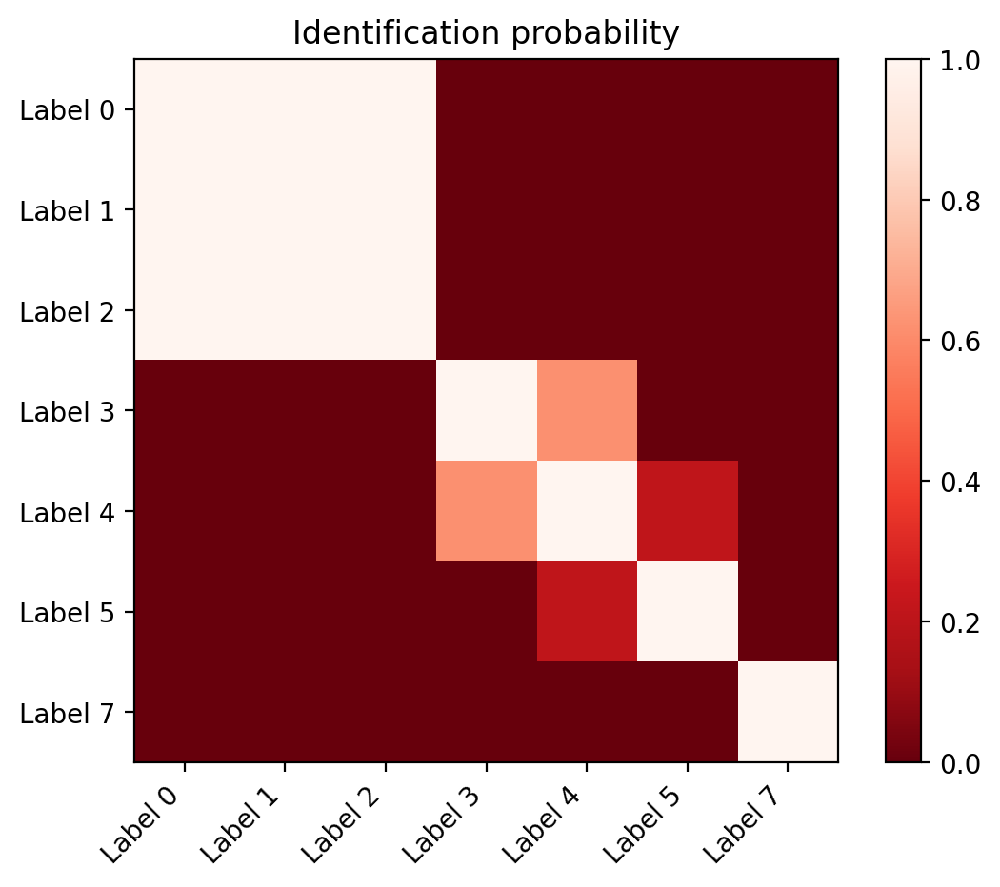
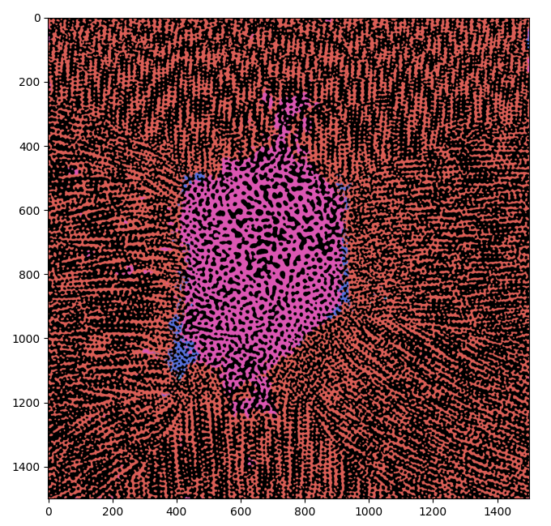
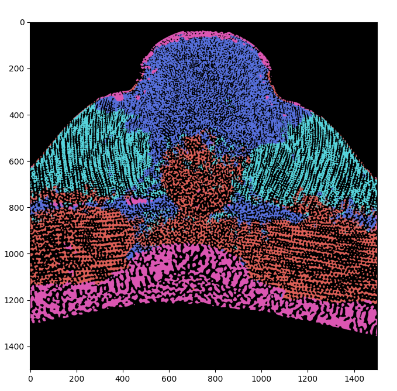
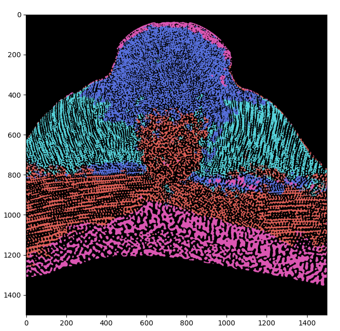

.. _rotational_similarity_page:

===========================================================
Case of study: identification for similarity under rotation
===========================================================

Once a set of reasonable valid clusters is obtained following the procedure explained in the tutorial ":ref:`Case of
study: segmentation pipeline <segmentation_pipeline_rst>`", the cluster properties can be investigated. One of
the most popular request is to understand if two clusters are similar up to a rotation in real space. In other words,
given the structures/textures associated to two valid clusters, the question the procedure presented here attempt to
answer is if they look similar and cannot anymore distinguished once one of the two is rotated by a suitable angle.

In this tutorial, the functioning of the operations developed to answer this question in bmmltools is explained. The
result will be a suggestion on the possible identification which can be done. Note that one speak bout "suggestions"
because as will be clear at the end ot this tutorial many things can go wrong, in particular when one checks if the
suggested equivalent relation is a proper equivalence relation in mathematical terms. Another important thing to keep
in mind, is that the procedure presented here has been developed in order to get an answer in a reasonable amount of
times using a modest amount of computational resources, due to the typical dimension of the input data on which these
analysis should be carried out.

Archetypes
==========

As observed at the end of the previous paragraph, a practical constrain on the for the solution of the rotational
similarity problem, is to get an answer in a limited amount of time and with a limited amount of computational
resources. This lead to the notion of *archetype of a given cluster*, which is a set of patches containing parts of
the input data located in regions of the data associated to the considered cluster. Archetypes are considered as good
representative of a given cluster, and are used to study the properties of a given clusters. To fulfil the requirements
mentioned above, the number of archetypes should be small compared to all the possible patches that can be extracted
from the regions associated to a given cluster.

[How they are defined]
To ensure that they well capture the properties of a cluster, archetypes are defined according to the requirements
below:

- Archetypes are sampled randomly from the central (core) part of cluster, since it is assumed that in this region the
  cluster properties are less ambiguous more regular. Randomness ensures that the criteria used to sample the regions
  of the cluster does not influence the properties encoded in the archetypes.

- The number of archetype considered is equal for all the valid clusters, in order to estimate all the statistical
  properties with similar level of uncertainty.

In practice, in bmmltools the `distance transform <https://en.wikipedia.org/wiki/Distance_transform>`_ is used to define
the regions for each clusters from which archetypes are uniformly samples in equal number for each cluster. Given the
output of the :ref:`ClusterValidator <cluster_validator_section>`, from the regions corresponding to a valid cluster is
reconstructed in the *patch space*, which contains a discrete coarse-grained representation of the clustering result
(see :ref:`here <general_structure_pipeline_section>` for more details), the distance transform is computed. In this way
one can just compute for each point in the patch space the smallest distance from the voxel and the cluster border. In
in this way one can put a threshold on the result obtained to select the regions having distance to the cluster border
at least equal to the threshold (actually the data is normalized to 1, therefore this threshold is a number between 0
and 1). Some time the patch space is too small to have a meaningful distance transform: in this case the patch space
is expanded by a certain factor :math:`N_i` for each dimension, so that each point along a given axis :math:`i`
corresponds to :math:`N_i` points in the expanded patch space. The distance transform and the threshold operation are
then taken in this expanded patch space. Once that the most central region of the cluster is found, it is sampled
randomly obtaining the set of archetypes corresponding to the cluster considered.

In bmmltools the archetypes for each clusters are obtained using the
:ref:`ArchetypeIdentifier <archetype_identifier_section>` operation. According to the description given, the most
important parameter to set are:

- ``archetype_threshold``, which is the threshold on the normalized distance transform defining the central part of
  the cluster in the (eventually expanded) patch space.

- ``N_archetype``, which clearly specify the number of archetype sampled for each cluster.

- ``extrapoints_per_dimension``: which is where one should declare if needed the expansion factor (one number for each
  dimension) used to construct the expanded patch space.

Finally, in addition to that in this operation one has always to specify the number of voxels per dimensions of the
patch used during the segmentation step in the ``patch_shape`` field.

Rotational Similarity measured with a statistical test
======================================================

In this section the criteria upon which the rotational similarity measure are explained, therefore it represent the
core part of the whole procedure used to identify clusters because rotationally similar. Given the set of archetypes
found for each label, the identification is suggested based on the similarity of the radial distribution of the
modulus of the periodic component of the 3d discrete Fourier transform. More precisely, given the discrete nature of
the data, given a patch :math:`\Phi(i_z,i_y,i_x)`, the modulus of the periodic component of the 3d Fourier transform
computed, i.e.

.. math::

   \hat{\Phi}(k_z,k_y,k_x) = |\mbox{pDFT}(\Phi)|(k_z,k_y,k_x).

This quantity is then evaluated in spherical coordinate obtaining :math:`\hat{\Phi}(k_\rho,k_\theta,k_\phi)`. Then
the radial distribution of :math:`\hat{\Phi}(k_\rho,k_\theta,k_\phi)` is computed obtaining the vector
:math:`\rho = (\rho_0,\cdots,\rho_{{N_\rho}-1})`. Each component of the vector is given by

.. math::

   \rho_i = \sum_{\rho_\theta,\rho_\phi} \hat{\Phi}(i,k_\theta,k_\phi) \sin(\theta(k_\theta))

which can be seen as the right Riemann sum approximating the integration over the angles of
:math:`\hat{\Phi}(k_\rho,k_\theta,k_\phi)` assuming :math:`\Delta \theta = \Delta \phi = 1` and where
:math:`\theta(k)` is :math:`k`-th value of the :math:`\theta` angle.

.. attention::

   Note that :math:`\rho` is not able to distinguish two different object which have a different angular
   organization but the same radial distribution. It is not to difficult to imagine how this can be achieved.
   Given two real number :math:`a` and :math:`b`, consider the two field below:

   .. math::

      \begin{align}
      \hat{\Phi}_A(k_\rho,k_\theta,k_\phi) &= a\delta_{k_{\theta_0},k_{\theta_1}} +
                                              b\delta_{k_{\theta_2},k_{\theta_3}} \\
      \hat{\Phi}_B(k_\rho,k_\theta,k_\phi) &= (a+b)\delta_{k_{\theta_0},k_{\theta_1}},
      \end{align}

   for some :math:`k_{\theta_0}`, :math:`k_{\theta_1}`, :math:`k_{\theta_2}`, and :math:`k_{\theta_3}`.
   It is not difficult to see that :math:`\rho_A = \rho_B`, despite the two field clearly have different angular
   distribution, therefore no rotation can map :math:`\hat{\Phi}_A` in :math:`\hat{\Phi}_B`, meaning that no rotation
   can make the patch A similar to the patch B. This lack in the discrimination ability of the the measure used for
   the rotational identification step is one of the reason why the result of this tutorial can be considered only
   as a suggestion. In practice, the situation above is not so likely to happens, since :math:`\hat{\Phi}` have to
   correspond to the modulus of a pDFT of a real structure/texture which is not trivial at all. Note also that this
   kind of problem would affect any other measure which removes the angular degrees of freedom by summing over them.

For each valid cluster, given the collection of archetypes produced by the :ref:`ArchetypeIdentifier
<archetype_identifier_section>` operation :math:`\{ \Phi^{(i)}(k_z,k_y,k_i) \}_{i=1}^N`, the radial distribution is
computed for each patch as explained above obtaining the collection :math:`\{ \rho^{(i)} \}_{i=1}^N`. The identification
among two or more cluster is based on the radial distributions of the archetypes. In particular, the identification
among two clusters is suggested if the radial distributions of the archetype of two clusters can be considered as
samples of a random variable coming from the same probability distribution.

To check that, the `Hotelling t^2 test <https://en.wikipedia.org/wiki/Hotelling%27s_T-squared_distribution>`_ is
performed, which is the statistical test used to understand if given a :math:`p`-dimensional random variable :math:`X`
sampled :math:`N` times, it has mean value :math:`\mu`. In the case considered here given two valid clusters A and B,
with radial distributions :math:`\{ \rho^{(i)}_A \}_{i=1}^N` and :math:`\{ \rho^{(i)}_B \}_{i=1}^N`, one computes
the mean values :math:`\mu_A` and :math:`\mu_B` and the covariance matrices :math:`\Sigma_A` and :math:`\Sigma_B`
having entries

.. math::

   \begin{align}
   \mu_{q,i} &= \frac{1}{N_{\rho_q}}\sum_{k=0}^{N_{\rho_q}-1} \rho_{q,i}^{(k)} \\
   \Sigma_{q,i,j} &= \sqrt{\frac{1}{N_{\rho_q}-1}\sum_{k=0}^{N_{\rho_q}-1} (\rho_{q,i}^{(k)}-\mu_{q,j})^2}
   \end{align}

with :math:`q = A,B`. The test is performed symmetrically on A and B, namely assuming A as sample and (the mean
of) B as reference, and viceversa. To do that the following quantities are defined

.. math::

   \begin{align}
   t^2_{AB} &= (\mu_A-\mu_B) \Sigma_A (\mu_A-\mu_B)^T \\
   t^2_{BA} &= (\mu_B-\mu_A) \Sigma_B (\mu_B-\mu_A)^T
   \end{align}

which are the statistics used in the Hotelling t^2 statistical tests. Given the centred F-distribution with degrees of
freedom :math:`p` and :math:`N-p`, :math:`F_{p,N-p}(x)`, one can define the confidence level :math:`\gamma_{AB}` of the
test for the null hypothesis, i.e. the statement that the radial distributions :math:`\{ \rho^{(i)}_A \}_{i=1}^N` have
mean value :math:`\mu_B`, as

.. math::

   \begin{align}
   \gamma_{AB} &= 1 - \alpha_{AB} \\
               &= 1 - \frac{N_{\rho_A}(N-N_{\rho_A}-1)}{N-1}F_{N_{\rho_A},N-N_{\rho_A}}(t^2_{AB}),
   \end{align}

where :math:`N` is the number of archetypes and :math:`N_{\rho_A}` is the number of values used to represent the
radial distribution of the cluster A. Similarly one can define :math:`\gamma_{BA}` as

.. math::

   \gamma_{BA} = 1 - \frac{N_{\rho_B}(N-N_{\rho_B}-1)}{N-1}F_{N_{\rho_B},N-N_{\rho_B}}(t^2_{BA})

For the Hotelling t^2 statistical test the statistical power of the test :math:`\eta` can be computed using the
*non-centred* F-distribution with parameter :math:`p`, :math:`N-p` and non-centrality parameter :math:`\delta`,
:math:`F^{nc}_{p,N-p,\delta}(x)`, as follow

.. math::

   \begin{align}
   \eta_{AB} &= 1-\frac{N_{\rho_A}(N-N_{\rho_A}-1)}{N-1}F^{nc}_{N_{\rho_A},N-N_{\rho_A},\delta_{AB}}(1-\gamma_{AB}) \\
   \eta_{BA} &= 1-\frac{N_{\rho_B}(N-N_{\rho_B}-1)}{N-1}F^{nc}_{N_{\rho_B},N-N_{\rho_B},\delta_{BA}}(1-\gamma_{BA}) \\
   \end{align}

where :math:`\delta_{AB} = (\mu_A-\mu_B) \Sigma_A (\mu_A-\mu_B)^T` and
:math:`\delta_{BA} = (\mu_B-\mu_A) \Sigma_B (\mu_B-\mu_A)^T` are the two non-centrality parameters of the two
non-central F-distributions used to compute the statistical power for the two tests.

.. attention::

   The Hotelling t^2 test has very low performance when the number of archetype for each valid cluster is very close
   to the number of points used to define the radial distribution, i.e. when :math:`N \approx N_{\rho}`. Moreover
   the centred F-distribution is not defined for :math:`N_{\rho} > N`. In
   :ref:`RotationalSimilarityIdentifier <rotational_similarity_identifier_section>` the user set the value
   :math:`N_{\rho}` when the shape of the archetype in spherical coordinate is declared, i.e. choosing the
   ``spherical_coordinates_shape``. The number of archetype :math:`N` can be selected by changing the ``N_archetype``
   parameter of the :ref:`ArchetypeIdentifier <archetype_identifier_section>` operation.

At this point in bmmltools the *identification probability between the cluster A and B* :math:`P(A = B)` is defined as

.. math::

   P(A = B) = \mbox{minimum}(\gamma_{AB},\gamma_{BA})

and while the *power of the statistical test* :math:`\beta` is equal to

.. math::

   \eta =
   \begin{cases}
   \eta_{AB} &\mbox{ if } \gamma_{AB} < \gamma_{BA} \\
   \eta_{BA} &\mbox{ otherwise.}
   \end{cases}

In both cases one can see that the result of the whole test is symmetric if A and B are exchanged. This has been chosen
in order to ensure the symmetry of the equivalence relation among the two clusters which can be derived from
:math:`P(A = B)` (see below).

.. note::

   The Hotelling t^2 tests used here are one-sample. Alternatively one can use the two-sample Hotelling t^2 test, but
   this is currently not implemented in any bmmltools operation.

It is reasonable to expect that two or more clusters are identified if their identification probability is *above a
certain threshold* :math:`p_{TH}`, i.e. define a *candidate* equivalence relation :math:`\mbox{ eq. }` as

.. math::

   A \mbox{ eq. } B \Longleftrightarrow P(A = B) > p_{TH}.

Despite this definition seem reasonable, things are not so straightforward, in particular when the relation defined
above involves more than 2 clusters. In this case additional constraints need to be fulfilled in order to speak about
real equivalence among the clusters. For example, consider 3 clusters A,B,C such that :math:`P(A=B) > p_{TH}`,
:math:`P(B=C) > p_{TH}` but :math:`P(A=C) < p_{TH}`.Naively, one could conclude from the first two that
:math:`A \mbox{ eq. } B`, :math:`B \mbox{ eq. } C` but :math:`A \mbox{ not eq. } C`. This is clearly not possible
since if :math:`A\mbox{ eq. }B` and :math:`B\mbox{ eq. }C` for a true equivalence relation among the three clusters
one would expect :math:`A\mbox{ eq. }C`, which contradicts the identification criteria chosen since
:math:`P(A=C) < p_{TH}`. This is the reason why :math:`\mbox{eq.}` is said 'candidate'. Indeed one needs to check that
the relation obtained by thresholding the identification probabilities, is a real equivalence relation in the sense of
the precise mathematical definition, which is reported below.

    **Definition**: Given a set :math:`U` a binary relation between two of its elements :math:`x,y \in U`, in symbol
    :math:`x \mbox{ Rel. } y`, is an equivalence relation if:

    * :math:`x \mbox{ Rel. } x` (reflexivity),

    * :math:`x \mbox{ Rel. } y` implies :math:`y \mbox{ Rel. } x` and viceversa (symmetry),

    * if :math:`x \mbox{ Rel. } y` and :math:`y \mbox{ Rel. } z` then :math:`x \mbox{ Rel. } z` (transitivity),

    where :math:`x,y,z \in U`.

In the case considered here the relation :math:`\mbox{eq.}` defined via the identification probability is reflexive (it
is easy to see that :math:`P(A=A)=1` always) and symmetric by construction, as already observed. Transitivity need to
be checked.

In bmmltools transitivity is checked by using the following idea. First, one constructs the graph :math:`G` having a
vertex for each cluster and an edge between two vertices if and only if their identification probability is above a
certain threshold (i.e. the relation :math:`\mbox{eq.}` defined above holds among the two considered clusters).
Then the transitivity can be checked by looking at the adjacency matrix of the graph :math:`G`, namely a matrix of
:math:`N_{vertices} \times N_{vertices}` having 1 in the :math:`(i,j)`-entry if and only if the vertex :math:`i` is
connected with the vertex :math:`j` (note that the :math:`(i,i)`-entry is always 1, because as noted above
:math:`\mbox{eq.}` is reflexive). Each connected component of :math:`G` (and singleton of :math:`G` too) defines a
*candidate* equivalence relation in the sense of the definition given above. It is really an equivalence relation
if and only if the adjacency matrix of the connected component has all the entries equal to 1, which would implies
that the relation :math:`\mbox{eq.}` holds among all the pairs needed to ensure transitivity.

In bmmltools the identification procedure described above is performed by the
:ref:`RotationalSimilarityIdentifier <rotational_similarity_identifier_section>` operation. According to the
description given, the crucial parameters to set are:

- ``p_threshold``, which corresponds to :math:``p_{TH}``.

- ``spherical_coordinates_shape``, which determine the shape of the archetype in spherical coordinates, therefore
  the first element of the tuple corresponds to :math:``N_\rho``.

- ``bin_used_in_radial_dist``, which is the minimum and maximum number of bins used for the for the statistical tests.
  This means that this parameter can reduce :math:`N_\rho`, since it reduces the number of values in the (part of
  the) radial distribution used for the statistical test.

.. attention::

   In the current implementation of the :ref:`RotationalSimilarityIdentifier <rotational_similarity_identifier_section>`
   operation, in case of lack of transitivity for the candidate equivalence relation is fully disregarded and only for
   the pair with the highest identification probability the identification is suggested. How to deal this situation
   is arbitrary and different policy are possible (the one adopted at the moment is the most conservative one).
   This is another reason why the final result of the procedure explained in this tutorial can only suggest a
   possible identification.

The outputs of the :ref:`RotationalSimilarityIdentifier <rotational_similarity_identifier_section>` are a matrix
containing the identification probabilities for each pair of clusters, a matrix with the statistical power of each test
used to produce the corresponding entry of the identification probability matrix and the identification matrix, where
the suggestions about possible identification (based on thresholding of the identification probabilities and
the transitivity check) are reported. In addition to these, also the :math:`(\theta,\phi)` angles among each pair of
clusters are reported (but clearly only the angles between cluster which are identifiable make sense). These angles
are computed by taking the maximum of the weighted sum of the correlation computed in the :math:`\theta\phi`-plane
for different radii among the each cluster pairs. More precisely, let :math:`\hat{\Phi}_A(k_\rho,k_\theta,k_\phi)` and
:math:`\hat{\Phi}_B(k_\rho,k_\theta,k_\phi)` be mean the modulus of the pDFT of the archetypes of two clusters A and B.
The angles between the structure associated to the two clusters is computed according to the formulas below.

.. math::

   (\theta,\phi) = \mbox{argmax }_{\theta,\phi} \sum_k w_{A,k}\mbox{corr }[\hat{\Phi}_A,\hat{\Phi}_B](k)

where :math:`\mbox{corr}[\hat{\Phi}_A,\hat{\Phi}_B]` is the 2d correlation computed in the :math:`\theta\phi`-plane
of the mean archetype of the two clusters. The :math:`w_{A,k}` are weights which tends to suppress the correlation at
those radii where :math:`\hat{\Phi}_A` does not vary too much in the :math:`\theta\phi`-plane. This is done using the
definition below.

.. math::

   \begin{align}
   w_{A,k} &= \frac{1}{N}\sqrt{ \frac{1}{N_\theta N_\phi}
                                  \sum_{k_\theta,k_\phi} \left( g^2_{A,\theta}(k,k_\theta,k_\phi)
                                  + g^2_{A,\phi}(k,k_\theta,k_\phi)\right)} \\
   g_{A,\theta}(k_\rho,k_\theta,k_\phi) &= \nabla_{k_\theta}\hat{\Phi}_A(k_\rho,k_\theta,k_\phi) \\
   g_{A,\phi}(k_\rho,k_\theta,k_\phi) &= \nabla_{k_\theta}\hat{\Phi}_A(k_\rho,k_\theta,k_\phi)
   \end{align}

where :math:`N_\theta` and :math:`N_\phi` is the number of different values along the :math:`\theta` and :math:`\phi`
axis of :math:`\hat{\Phi}`, while :math:`N` is such that :math:`\sum_i w_{A,i} = 1`.

Example
=======

The code below show how to use the two operations described above for the identification of clusters due to their
similarity under rotation.

.. code::

   #...
   from bmmltools.operations.clustering import ArchetypeIdentifier,RotationalSimilarityIdentifier

   # link a trace containing the ClusterValidator output.
   # trace = ...

   ## segmentation pipeline
   x = ArchetypeIdentifier(trace)\
        .io('ClusterValidator OUTPUT DATASET NAME','archetype_dataset')\
        .apply(patch_shape=(50,50,50), extrapoints_per_dimension=(2,2,2), save_archetype_mask=False)
   x = RotationalSimilarityIdentifier()\
        .io(x+['Binarizer OUTPUT DATASET NAME',],'post_rsi_dataset')\
        .apply()

   ## intermediate result readings
   RotationalSimilarityIdentifier(trace).o(x+['ClusterValidator OUTPUT DATASET NAME',]).read()

Continuing the :ref:`example of the "Case of study: segmentation pipeline" <example_segmentation_pipeline>`, the
following identification probabilities can be obtained

|

By checking transitivity of the candidate equivalence relation obtained by thresholding (with a threshold of 0.6) these
identification probabilities, the following equivalence relation is suggested:

* Label 0, Label 1 and Label 2 can be grouped in a unique cluster;

* Label 3 and Label 4 can be grouped in a unique cluster.

By using these identification, on the final segmentation obtained one obtains

|

|

|

