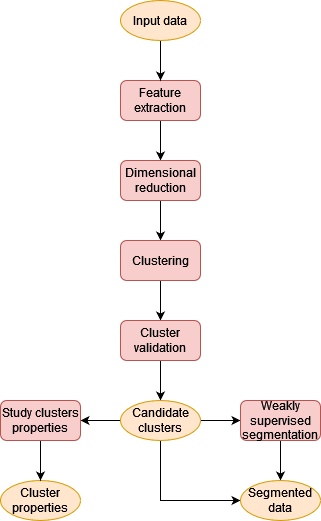
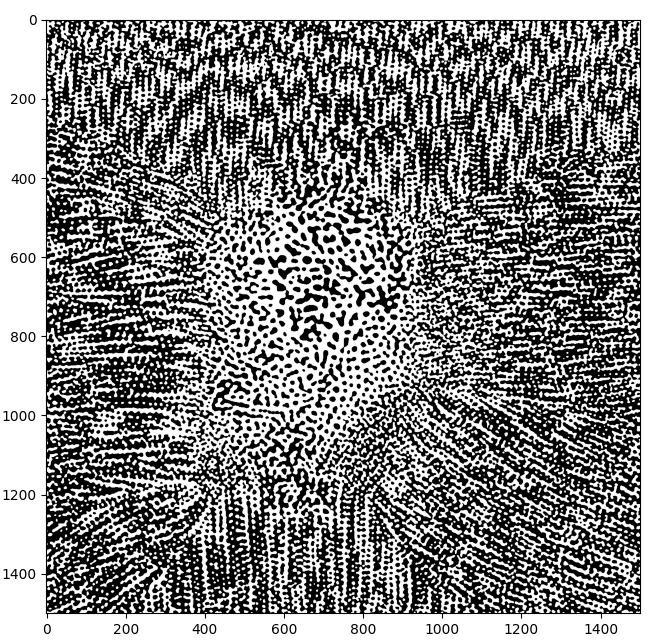
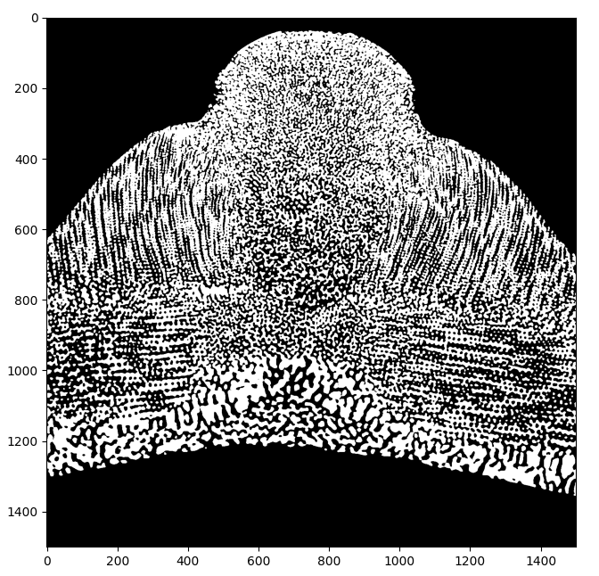
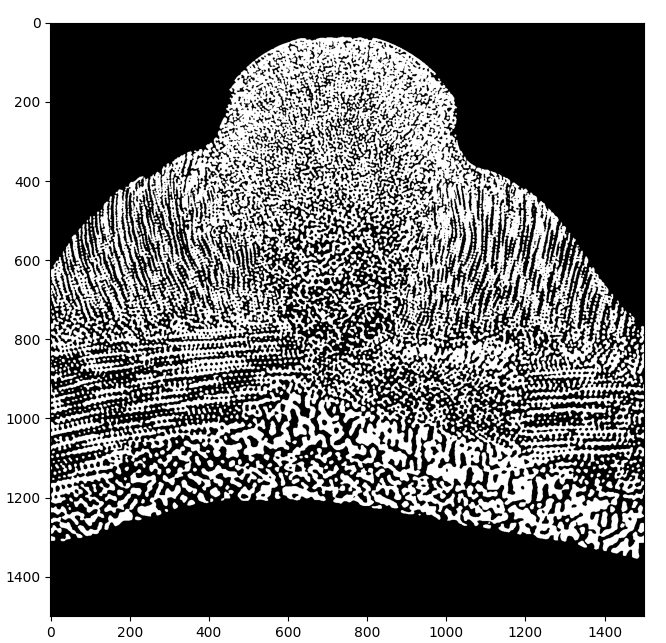
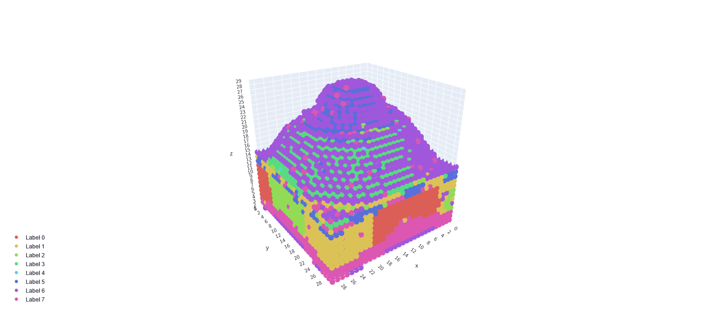
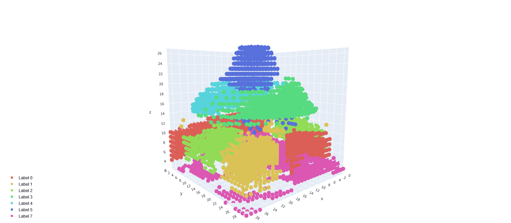
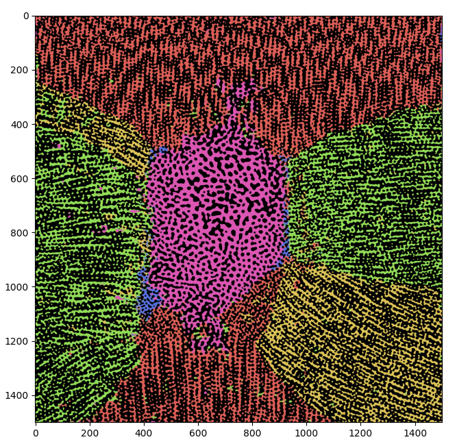
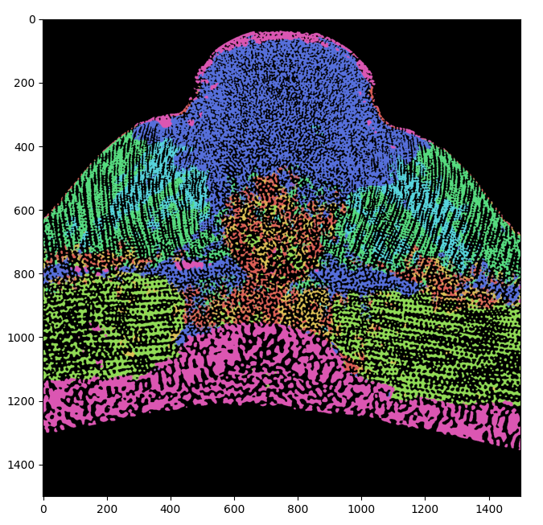
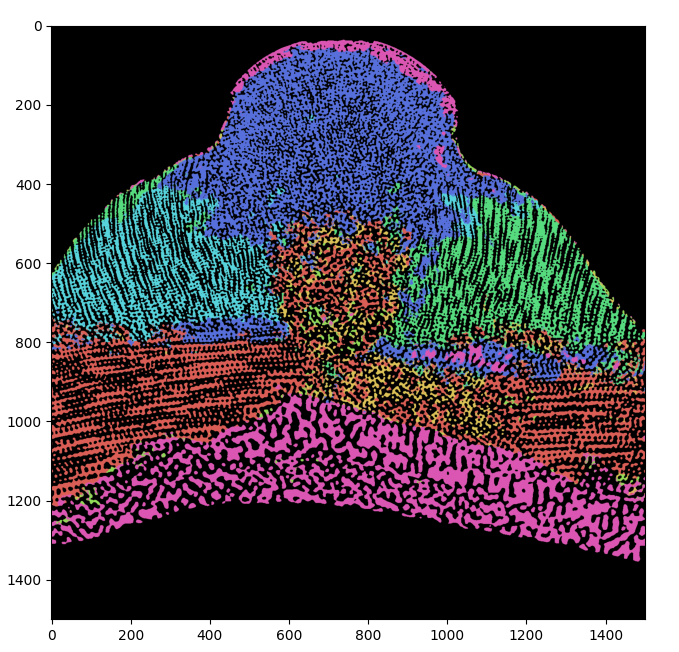

.. _segmentation_pipeline_rst:

====================================
Case of study: segmentation pipeline
====================================

In this tutorial it is described a possible sequence of operations for the segmentation in a 3d binary images of a
biological sample of regions having different structural/texture properties.

Goals
=====

The sequence of operations (pipeline) described in this tutorial has been developed to achieve the following goal.

*  Perform the segmentation of a 3d binary image coming from various biological samples studied for their
   structural/textural properties. In practice this means to color in different manner the regions of the sample
   whose structures are similar.

However this have to be done under a series of requirements which heavily influence the way to proceed, as will be clear
from the next sections. The main requirement is the following:

* The segmentation does not have a ground true reference. This means that the user does not have to specify in advance
  which are the different structures present in the sample, or a set of criteria which can be used to identify the
  different regions composing the sample.

At a first look this requirement look very unrealistic, by the way this is a quite common situation for big 3d samples
since labelling some them (i.e. producing a ground true reference) is a very time consuming operation and more
importantly even the expert in the field may not label them in an objective way. This means that the labelling can be
highly subjective, making hard to consider it as a solid ground true reference for the problem. Indeed these samples
are typically produced to study their properties, therefore it is natural that their defining properties are not known
in advance.

.. _general_structure_pipeline_section:

General structure of the pipeline
=================================

Once the goals and the requirements under which they have to be achieved are set, one can start to design a general
solution for the problem under consideration.

First of all the lack of a ground true reference force to work with a clustering algorithm. However, not all
the clustering algorithm are suitable for the case considered here. Since no ground true is available, all the
clustering algorithms where the number of cluster has to be specified in advance are excluded. Therefore the lack of
ground true force to use density-based or hierarchical clustering algorithm.

It is quite reasonable to assume that assignment of a voxel to a given cluster can be based on the local environment
around that voxel, i.e. the cluster assigned to a given voxel depends not only on the voxel itself but also to a set of
voxels surrounding the one considered. This local environment when assumes a sufficiently regular shape (e.g. a cube or
a rectangular parallelepiped) is called *patch*. Therefore, in principle, one may define the dataset for the clustering
algorithm, as the set of all the possible patches centred around all the voxels of the sample. By the way this makes
the problem intractable from may point of view.

First of all, a dateset constructed in this way would be huge, for the typical 3d images collected in biological
setting. Indeed, assuming the typical 3d binary image has  :math:`\sim10^3` voxels per dimension, the whole image has
in total :math:`\sim10^9` voxels. Therefore the dataset for the clustering algorithm would have :math:`\sim10^9`
datapoint, and each datapoint would have the same number of voxels the patch would have. A reasonable patch dimension
is of the order :math:`\sim10^3` (i.e. :math:`\sim10` voxels per dimension). With these numbers the dataset is
typically too big for a clustering algorithm to perform well. Moreover, it is not at all guaranteed that the clustering
algorithm is able to identify easily the various components in the input data from patches containing simply a small
portion of the input data. It can be that a better representation can be found, in order to recognize different regions
based on structural/texture properties. All this force first to extract suitable features from the patches and then
eventually use dimensional reduction techniques *before* the training of the clustering algorithm in order to reduce
the dimension of the training dataset.

Once the clusters are obtained one needs to understand if the clusters found make sense or not. Indeed any
clustering algorithm depends on parameters. It is very unlikely that the parameters can be deduced from an inspection
of the input data alone, and a trial-and-error approach has to be followed. This implies two things:

1. The clustering algorithm should give the clustering result in a reasonable amount of time, so that the user can
   inspect the result and change the parameters rapidly and find the best combination to achieve a reasonable result.
   This can be done by reducing the number of datapoint of the training dataset in a reasonable manner. A good approach
   is the one to construct the dataset from patches which does not superimpose among each other but still filling whole
   volume of the input data. In practice this means to divide the input data according to a 3d grid which use the chosen
   patch as unit cell. In this way by assigning a cluster label to each patch "taken from the 3d grid" one can obtain
   a coarse-grained representation of the final clustering which can be used to evaluate the "goodness" of the clusters
   obtained using a given set of parameters. This coarse-grained representation is what in bmmltools is called
   *patch space*.

2. The clusters obtained need to be validated, i.e. they need to fulfil a basic set of requirements in order to be
   considered valid and not just noise (keep in mind that a clustering algorithm is able to find clusters also from
   noise when certain parameter combinations are used). The basic requirements one may require can be a certain degree
   of spatial continuity or a volume above a given threshold. Controls like these can be executed fast if they are done
   in the patch space. The clusters respecting the requirements chosen are called in bmmltoos *valid clusters* or
   *candidate clusters*.

Once the valid clusters are obtained one may proceed in different way depending on then needs. A simple segmentation
result can be obtained by assigning different colors to the regions of the original data whose patches has different
labels. In this way one would obtain a segmentation whose contour are based one the geometric shape of the patch chosen
This segmentation in bmmltools is called *raw labels segmentation* or *valid labels segmentation*, depending if it is
constructed using the cluster before or after validation.

To go beyond the segmentation done at the level of the patches mentioned before, one can perform a segmentation at
voxel level by using the clusters (validated) as *weak labels* for a supervised segmentation algorithm. The segmentation
obtained in this way is called in bmmltools *refined segmentation*: it should look "nicer" from the border point of view
but it is typically very time consuming: therefore one should do this step only when one is certain about the clusters
obtained. Moreover, the result obtained does not add nothing from the quantitative point of view since all the
information about the clusters can be derived already from the valid labels segmentation.

Finally, one can start to study various cluster properties. An example of study of the cluster properties is described
in the :ref:`"Case of study: identification for similarity under rotation" <rotational_similarity_page>`
section of this manual, where the rotational properties of the various clusters found are studied in order to suggest
which clusters can be identified among each other, because they differ just by a rotation.

The whole procedure is schematized in the diagram below.

|

The segmentation pipeline in detail
===================================

In this section a possible pipeline  of operation based on the general scheme described in the previous section is
discussed in details.

Feature extraction
------------------

The aim of the feature extraction step is to find a good representation of the portion of input data contained in
each patch. The structural/texture properties are well encoded in the modulus of the 3d discrete Fourier transform.
Two reason can be given for that (at lest from a qualitative point of view):

1. Mathematically the structural/texture properties of a 3d binary mask can be well described in terms of
   almost-periodicity [Amerio1989]_. In Fourier space the representation of almost-periodic function is particularly
   compact, since in this space the modulus of an almost periodic function would be peaked on the (pseudo-)frequencies
   associated with the main almost-periodicity. Therefore, the modulus of the 3d discrete Fourier transform should
   contain most of the information about the structure/texture.

2. Structural/texture properties are properties that are highly delocalized in space. Therefore it is reasonable to
   expect that in Fourier space the information is much more concentrated. This is compatible with the entropic
   uncertainty relations holding for the discrete Fourier transform [DeBrunner2005]_, since the lower bound on the
   entropy in the Fourier space would decrease, if the entropy in the real space is high (as one should expect for
   functions highly delocalized in space).

A technical point need to be done here. A patch is typically a small object, and this has consequences on its discrete
Fourier transform. In particular the lack of periodicity at the boundary would imply the presence of a series of
boundary artifacts, which should be removed to "display" better the information about the almost periodicity of the
structural/texture properties of the sample. A possible technique to remove the boundary artefacts present in the
discrete Fourier transform is to consider just the periodic component of the periodic-smooth decomposition of the
discrete Fourier transform (pDFT for short) [Moisan2011]_.

From the arguments above, one can conclude that the :ref:`PatchDiscreteFourierTransform3D <patch_dft_3d_section>` has to
be used wit the following parameters in the ``apply`` method:

- ``patch_shape = (A,B,C)``, i.e. choosing a patch with dimension :math:`A\times B\times C` using the zyx ordering;

- ``representation = 'module-phase'``;

- ``use_periodic_smooth_decomposition = True``.

With this setting, the operation will perform the pDFT on a 3d grid constructed using the patch chosen as building
block producing the dataset used for  (the inference of, see below) dimensional reduction step.

According to the general scheme given in the previous section the next step will be the dimensional reduction. As will
be clear from the previous, this operation need to be trained on some dataset. In order to avoid to have any
unreal grid-dependent feature in the training dataset of the dimensional reduction techniques, one can use the pDFT of
patches sampled randomly from the input dataset. In practice this means to use the :ref:`PatchDiscreteFourierTransform3D
<patch_dft_3d_section>` a second time on the same input dataset but with the setting below in the ``apply`` method.

- ``patch_shape = (A,B,C)``;

- ``representation = 'module-phase'``;

- ``use_periodic_smooth_decomposition = True``;

- ``random_patches = True``;

- ``n_random_patches = N``, where :math:`N` is the number of random patches to sample.

With this setting a training dataset for the dimensional reduction step can be produced, while the dataset obtained
previously can be used as inference dataset for the next step.

Dimensional reduction
---------------------

Once that the modulus of the pDFT has been computed one obtain an object having the same dimension of the original
patch, which is too big and its dimensionality need to be reduced. The dimensional reduction technique used should be
as much as possible agnostic on the nature of the input data: in this way the lack of specific criteria for the
identification of different components of the sample is not a problem. Dimensional reduction techniques whose working
principle are based on the statistical properties of a dataset are a good candidate for that step.

In general, deep autoencoders [Hinton2006]_ should be able to find a lower dimensional representation of the dataset on
which are trained. This representation is "adapted" to the dataset during the autoencoder training. The simplest
autoencoder one can imagine is a linear autoencoder trained using the mean square error as loss function
to quantify the reconstruction error of the decoder. It is known that this kind of autoencoder is equivalent (up to
a rotation in the latent space, i.e. the vector space in which the low-dimensional representation exist) to a PCA
[Bourlard1988]_ [Chicco2014]_. Therefore one can simply use a PCA to get a first dimensional reduction, and if the
representation found is not good one can try with more complex autoencoders (currently not implemented in bmmltools).

Therefore, one should use the operation :ref:`DimensionalReduction_PCA <dimensional_reduction_section>` with the setting
below in the ``apply`` method.

- ``inference_key = 'module'``, since only the module of the pDFT is used;

- ``training_key = 'module'``, for the same reason of above;

- ``n_components = M``, where :math:`M` is the number of PCA component to keep, i.e. the dimension of the latent space.
  It should be a small number compared to the number of voxels of in the patch.

As anticipated in the previous subsection, to avoid to have a grid-dependent low dimensional representation, the
training dataset is produced sampling randomly the input data, while the inference is done on grid.

A further step before clustering is needed: the data standardization. No particular justification for that can be given,
but it has been observed that the clustering gives better result. This can be done by using the operation
:ref:`DataStandardization <data_standardization_section>` with the setting in the ``apply`` method below.

- ``axis = (1,0)``, which is the configuration giving the best results in the case tested.

Clustering and validation
-------------------------

A quite powerful clustering algorithm is the HDBSCAN, which is a hierarchical density-based clustering algorithm
[Campello2013]_ [McInnes2017]_. It does not need to know in advance the number of clusters, but it needs a series of
parameters whose meaning can be found `here <https://hdbscan.readthedocs.io/en/latest/index.html>`_. The most
significant parameters to modify in order to influence the clustering are ``min_cluster_size``, ``metric`` and
``min_samples``.

The operation performing HDBSCAN in bmmltools is :ref:`Clusterer_HDBSCAN <cluster_HDBSCAN_section>`. In the ``apply``
method the HDBSCAN parameter need to be specified as dictionary in the ``p`` parameter.

.. attention::

   The HDBSCAN parameters are probably the parameters that more frequently need to be modified by the user, till a
   reasonable result is obtained in the patch space. If no reasonable clustering is found by modifying these parameters
   try to increase the number of components used in the dimensional reduction step.

After that the clusters are found, one needs to validate them for the reason explained in the previous section.
Validation in bmmltools con be done using the :ref:`ClusterValidator <cluster_validator_section>`. This operation
check for (a certain degree of) spatial continuity of the clusters found in patch space and the minimum volume a
cluster should have in order to be considered valid. The default setting are the less restrictive one.

Weakly supervised segmentation
-------------------------------

The segmentation one can obtain from the valid clusters, can be found to train in weakly supervised manner a classifier
to predict for each voxel of the sample the corresponding cluster. This kind of segmentation should have nicer borders
compared to the one can obtain by labeling the patches. In bmmltools a Random Forest classifiers is used.

The operation :ref:`RandomForestSegmenter <random_forest_segmentation_section>` can be used to perform this kind of
segmentation.

.. _example_segmentation_pipeline:

Example
=======

Below three slice of some input data to label are shown.

|

|

|

The code implementing the pipeline described in the previous sections is reported below. In addition to the operations
described in the previous section, there are two operations are done before to apply the operation performing the pDFT.
Input and Binarizer operations are there for technical reason: the first is used to specify the input dataset, while
Binarized is used to standardize the input binary mask to 0-1 values.

.. code::

   from bmmltools.operations.io import Input,OutputRawLabels,OutputValidLabels,OutputSegmentation
   from bmmltools.operations.feature import Binarizer,PatchDiscreteFourierTransform3D,DimensionalReduction_PCA,\
                                             DataStandardization
   from bmmltools.operations.clustering import Clusterer_HDBSCAN,ClusterValidator,ArchetypeIdentifier,\
                                                RotationalSimilarityIdentifier
   from bmmltools.operations.segmentation import RandomForestSegmenter

   # load data
   # data = ...

   # create a trace
   # trace = ...

   ## segmentation pipeline
    x = Input(trace).i('reg_sea_urchin').apply(data)
    x = Binarizer(trace).i(x).apply()
    x1 = PatchDiscreteFourierTransform3D(trace)\
            .io(x,'post_pdft3d_inference_dataset')\
            .apply(patch_shape=(50,50,50))
    x2 = PatchDiscreteFourierTransform3D(trace)\
            .io(x,'post_pdft3d_training_dataset')\
            .apply(patch_shape=(50,50,50),random_patches=True,n_random_patches=4000)
    x = DimensionalReduction_PCA(trace)\
            .io(x1+x2,['post_dm_pca_inference_dataset'])\
            .apply(inference_key='module',training_key='module',save_model=True)
    x = DataStandardization(trace).io(x[0],'post_ds_inference_dataset').apply(axis=(1,0))
    x = Clusterer_HDBSCAN(trace)\
            .io(x+['post_pdft3d_inference_dataset',],'raw_labels_dataset')\
            .apply(p=dict(min_cluster_size=15,prediction_data=True,metric='euclidean',min_samples=2),save_model=True)
    x = ClusterValidator(trace).io(x,'valid_labels_dataset').apply()
    x = RandomForestSegmenter(trace)\
        .io(['post_b_dataset']+x,'segmentation_result')\
        .apply(patch_shape=(50,50,50),inference_split_shape=(3,3,3),
               n_estimators=50,N_training_samples_per_label=1000,n_sigma=5,
               temp_folder_path=r'SOME PATH FOR TEMPORARY FILE')

    ## outputs
    OutputRawLabels(trace).i(['post_b_dataset','raw_labels_dataset']).apply(patch_shape=(50,50,50))
    OutputValidLabels(trace).i(['post_b_dataset','valid_labels_dataset']).apply(patch_shape=(50,50,50))
    OutputSegmentation(trace).i(['post_b_dataset','segmentation_result','valid_labels_dataset']).apply(use_rgb=False)

The clusters produced by the HDBSCAN_Clusterer are shoed below in patch space

|

With the clustering algorithm 8 different cluster can be identified, but only 7 are real. The validation step is
able to eliminate the dark violet one (cluster number 6), which is unrealistic since it is a border artifact. The core
points of the valid clusters are showed below.

|

The final segmentation using the RandomForestSegmenter can be seen below.

|

|

|

Reference
=========

.. [Amerio1989] Amerio, Luigi. "Almost-periodic functions in banach spaces." in The Harald Bohr Centenary: proceedings
   of a Symposium held in Copenhagen April 24-25, 1987 - C. Berg and B. Fuglede - Matematisk-fysiske
   Meddelelser 42:3, 1989.

.. [DeBrunner2005] DeBrunner, Victor, et al. "Entropy-based uncertainty measures for :math:`L^2(R^n)`, :math:`l^2( Z)`,
   and :math:`l^2(Z/NZ)` with a Hirschman optimal transform for :math:`l^2(Z/NZ)`." IEEE Transactions on Signal
   Processing 53.8 (2005): 2690-2699.

.. [Moisan2011] Moisan, Lionel. "Periodic plus smooth image decomposition." Journal of Mathematical Imaging and Vision
   39.2 (2011): 161-179.

.. [McInnes2017] McInnes, Leland, and John Healy. "Accelerated hierarchical density based clustering." 2017 IEEE
   International Conference on Data Mining Workshops (ICDMW). IEEE, 2017.

.. [Campello2013] Campello, Ricardo JGB, Davoud Moulavi, and Jörg Sander. "Density-based clustering based on
   hierarchical density estimates." Pacific-Asia conference on knowledge discovery and data mining. Springer,
   Berlin, Heidelberg, 2013.

.. [Bourlard1988] Bourlard, Hervé, and Yves Kamp. "Auto-association by multilayer perceptrons and singular value
   decomposition." Biological cybernetics 59.4 (1988): 291-294.

.. [Chicco2014] Chicco, Davide, Peter Sadowski, and Pierre Baldi. "Deep autoencoder neural networks for gene ontology
   annotation predictions." Proceedings of the 5th ACM conference on bioinformatics, computational biology, and health
   informatics. 2014.

.. [Hinton2006] Hinton, Geoffrey E., and Ruslan R. Salakhutdinov. "Reducing the dimensionality of data with neural
   networks." science 313.5786 (2006): 504-507.